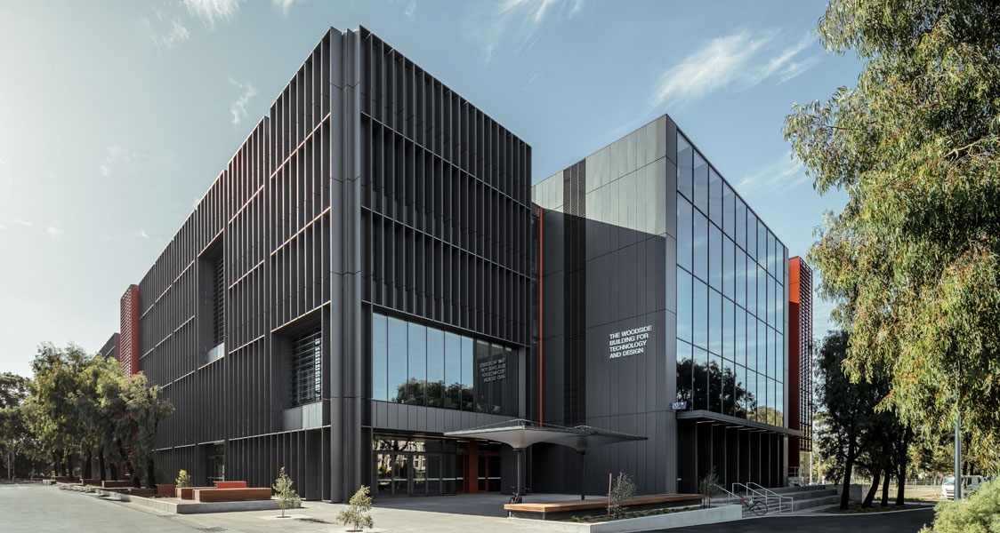

# quake2021
Data and analysis relating to the 5.8M Melbourne quake of 2021

## Monash University Woodside Living Lab Building
The building is located [here](https://goo.gl/maps/7iDsWFYNjBhht38x9)

The building is two structures, separated by an expansion joint. Key channels for the south building are:

| Floor | AOD | NW | NE | SE | SW |
|:-----:|:---:|:--:|:--:|:--:|:--:|
|   LG  |  93 |  3 |  5 |  4 |  2 |
|   01  |  98 | 10 | 12 | 11 |  9 |
|   02  | 104 | 17 | 19 | 18 | 16 |
|   03  | 108 | 24 | 26 | 25 | 23 |
|   RF  | 113 | 31 | 33 | 32 | 30 |

Each sensor has a X and Y axes reading:
- Y+ points North
- X+ points East

Dimensions on the floor plate are approximately:
- 24 m East-West
- 50 m North-South

## Sensors
The accelerometers are Silicon Designs MEMS, Model 22120-002 with +/- 2g range, and sensitivity of 2000 mV/g. A data sheet is available [here](https://drive.google.com/file/d/142NbYdEPjYqU1gCK9ELptHQghMXgA1qA/view)

The readings are in "g" units, and must be zeroed from the start of the recording.

